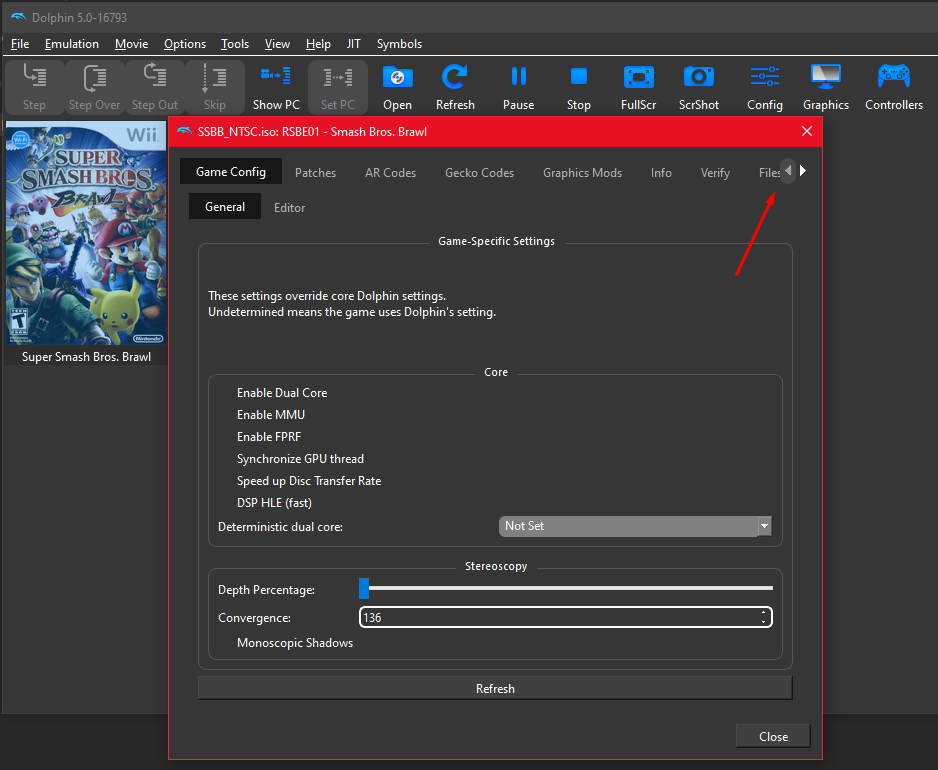
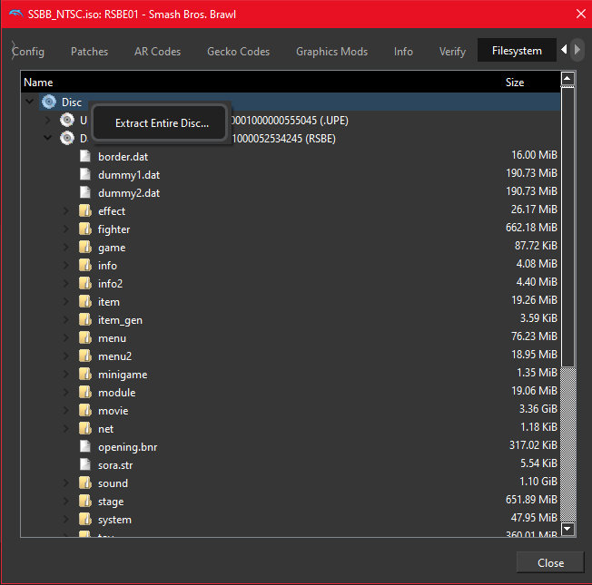

# Super Smash Bros. Brawl SiIvagunner Mega Music Mod

This mod adds all the high quality Super Smash Bros. Brawl rips of the SiIvagunner and Timmy Turner's Grand Dad Channel to Super Smash Bros. Brawl. Every rip replaces its corresponding original track and where there are multiple rips, they are all put in a loop.

# How to Install

1. [Click here to download the latest release!]()

Just replace the respective files in the internal file system of the game. In detail, this means:

In Dolphin:

2. In the Dolphin game selection, right-click on your Brawl ISO, choose properties and click on the "Filesystem" tab (as it's the last/rightmost tab of the "properties" window, you might have to enlarge the window or click on the right arrow to see it. See the pic below).

3. Right click on "Disc" and choose "Extract Entire Disc". Save it in a new folder. (As this copies all the game data, make sure you have at least 7.5 GB to spare.)

4. Drag the `DATA` folder from the downloaded zip into the folder you extracted the disc, so that it get's merged with the `DATA` folder inside. If you did everything right, you should be told, that files with the same names already exist: Choose "Replace" for all files.

5. To start the modded game, press the "Open" button in Dolphin and choose `YOUR ISO FOLDER\DATA\sys\main.dol`.
